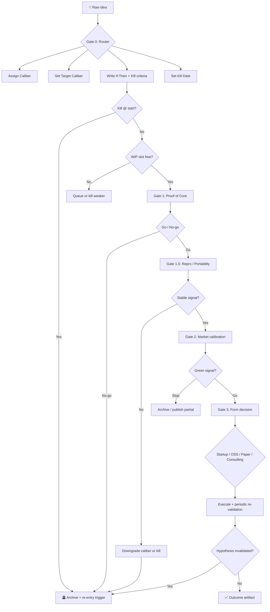
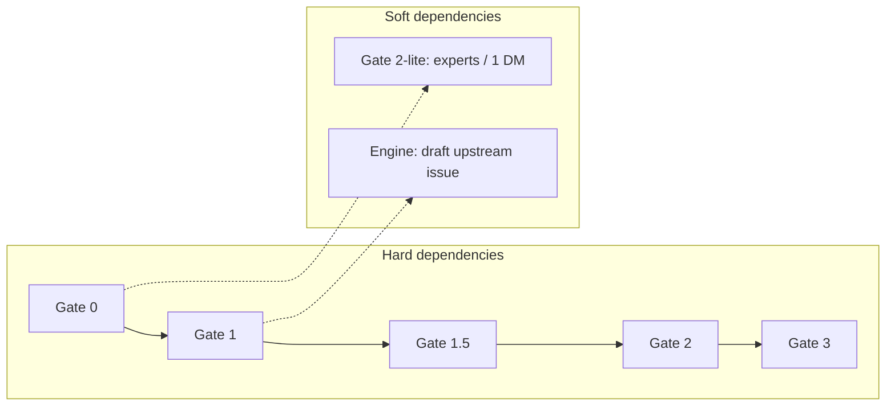
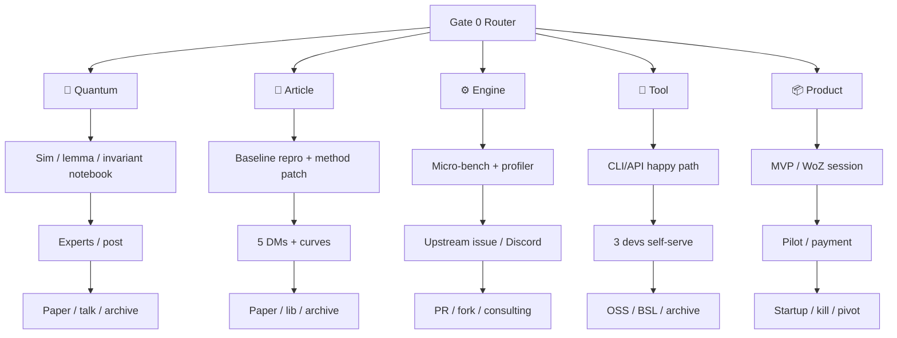
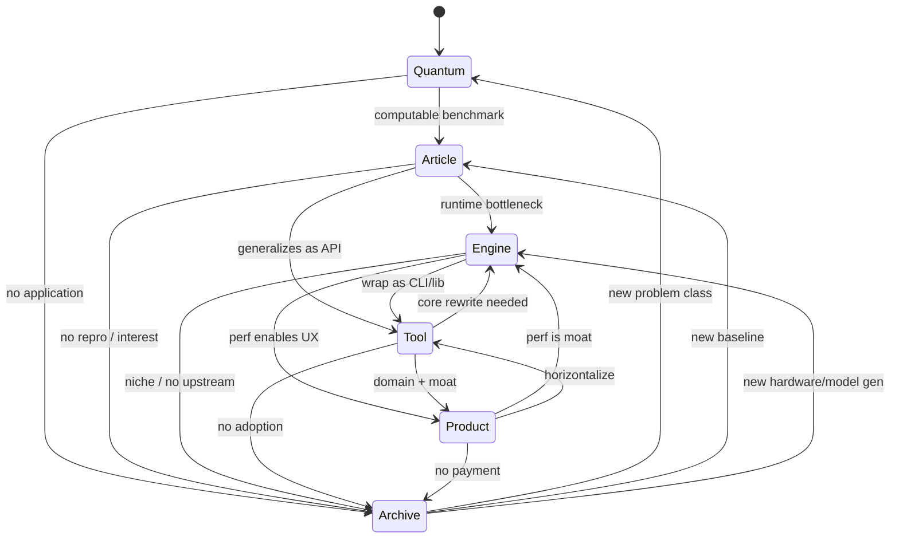
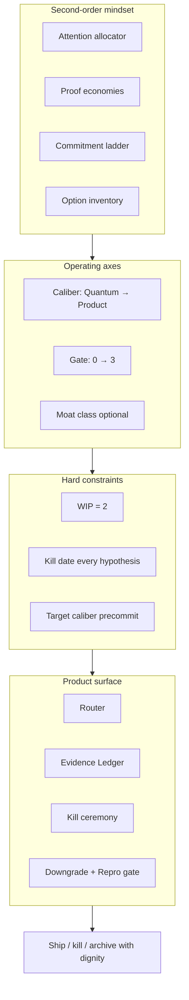

# Caliber

**Discipline OS for solo deeptech & AI**

> Five calibers. Four gates. Two slots.

---

## Table of Contents

1. [Manifesto](#1-manifesto)
2. [Problem](#2-problem)
3. [Solution](#3-solution)
4. [Brand & Positioning](#4-brand--positioning)
5. [Architecture: Two Axes](#5-architecture-two-axes)
6. [Caliber Spectrum](#6-caliber-spectrum)
7. [Gate Pipeline](#7-gate-pipeline)
8. [Caliber × Gate Playbook](#8-caliber--gate-playbook)
9. [Operational Rules](#9-operational-rules)
10. [Gate 3: Decision Matrix](#10-gate-3-decision-matrix)
11. [Caliber Transitions](#11-caliber-transitions)
12. [Portfolio Layer](#12-portfolio-layer)
13. [Second-Order Meanings](#13-second-order-meanings)
14. [Pipeline Maps & Dependencies](#14-pipeline-maps--dependencies)
15. [Moat Class (Third Axis)](#15-moat-class-third-axis)
16. [Emotional States & Anti-Patterns](#16-emotional-states--anti-patterns)
17. [North Star Metrics](#17-north-star-metrics)
18. [Product Roadmap & Killer Features](#18-product-roadmap--killer-features)
19. [Glossary](#19-glossary)
20. [Worked Examples](#20-worked-examples)
21. [Elevator Pitches](#21-elevator-pitches)
22. [Open Decisions](#22-open-decisions)

---

## 1. Manifesto

**Not every hypothesis deserves a startup. Every hypothesis deserves a gate.**

Solo deeptech & AI R&D breaks when:

- algebra gets validated with latency benchmarks;
- micro-optimizations get dragged into SaaS;
- technical success gets confused with product-market fit;
- ideas live for months without a kill date.

**Caliber** is not a startup framework and not academic reproducibility in isolation. It is an **operating system for technical hypotheses**: classify by caliber, pass gates with kill-criteria, decide — startup, OSS, paper, or archive.

**Core promise:** stop mixing proof currencies. Kill fast. Downgrade without shame. Run two hypotheses, not twenty.

---

## 2. Problem

### Who hurts

**Primary:** solo founder / indie researcher in deeptech & AI — one person juggling theory, PyTorch, inference engines, and occasional product fantasies.

**Secondary:** tiny R&D teams (2–3) needing a shared prioritization language.

**Not for:** VC-backed teams with PM + sales (different granularity).

### Symptoms

| Symptom | Root cause |
|---------|------------|
| Months on an idea with no artifact | No Gate 0 formalization, no kill date |
| Beautiful theory, zero applications | Wrong market gate or skipped entirely |
| +2% benchmark → "platform company" | Caliber laundering (upgrade without evidence) |
| Micro-optimization → SaaS scope creep | No target caliber precommitment |
| Two "products" in parallel | WIP limit violated → identity fragmentation |
| "It works on my machine" | Skipped Gate 1.5 reproducibility |
| Archive = shame graveyard | No post-mortem, no re-entry trigger |

### Scarce resource (second-order)

The bottleneck is not GPU or ideas — it is **attention and narrative coherence**. Caliber allocates the single active mental slot to hypotheses that earned it.

---

## 3. Solution

### One sentence

**Technical hypothesis operating system:** two axes (caliber of value × gate of proof), hard kill-criteria, WIP = 2 — every idea gets evidence and a route, or dies quickly without shame.

### What Caliber is / is not

| Caliber is | Caliber is not |
|------------|----------------|
| Allocator of scarce attention | Idea brainstorming tool |
| Caliber-aware proof ladder | Generic Lean Startup |
| Kill-first discipline OS | Motivation / productivity app |
| Evidence ledger culture | Task tracker with extra steps |
| Honest "not a startup" matrix | "Everything can be a unicorn" |

### Analogues (by spirit, not form)

- **Lean Startup** — but for *technical proof*, not only customer interviews
- **Shape Up** — but for *solo* with caliber-specific kill-criteria
- **RFC / design doc culture** — but with mandatory *market gate* before full build

---

## 4. Brand & Positioning

### Name hierarchy

```
Caliber                              ← product / method name
Discipline OS for solo deeptech & AI ← category + audience
Five calibers. Four gates. Two slots. ← mnemonic (hero line)
```

### Taglines

| Use | Line |
|-----|------|
| Hero | Five calibers. Four gates. Two slots. |
| Philosophical | Not every hypothesis deserves a startup. Every hypothesis deserves a gate. |
| Punchy | Where hypotheses earn their next week of your life. |
| RU (community) | Не стартап — калибр. Не мечта — gate. |

### Voice

- **Direct** — no corporate fluff
- **Kill-positive** — killing a hypothesis is a win
- **Caliber-literate** — never mix proof currencies
- **Solo-realistic** — two slots, not "move fast and break things"

**Say:** kill date, target caliber, evidence ledger, downgrade to Tool  
**Don't say:** unlock your potential, 10x your ideas

### Jobs To Be Done

| When… | I want… | So that… |
|-------|---------|----------|
| A new idea appears | classify caliber in 15 min | I don't commit weeks without formulation |
| I've coded for 2 weeks | know my gate + expected artifact | I don't build a product around a micro-bench |
| It technically works | market-check without full MVP | I don't confuse repro with PMF |
| Two projects pull | pick one, kill/park the other | I don't burn out |
| Paper/engine is ready | choose startup vs OSS vs paper | I don't drag sales if I want R&D |

### Competitive differentiation

| Alternative | Weakness for solo deeptech/AI | Caliber answer |
|-------------|-------------------------------|----------------|
| Generic Lean / CustDev | Doesn't separate theory from SaaS | 5 calibers |
| Academic publish-or-perish | No market gate | Gate 2 before full paper |
| "Just ship OSS" | No startup vs OSS decision | Gate 3 + target caliber |
| Personal PKM | No kill-criteria | Time-box + stop rules |
| AI "rate my idea" | No structure or artifacts | Gates + templates + WIP |

### Product evolution (L0 → L4)

| Level | Format | Value |
|-------|--------|-------|
| **L0 — Method** | This document / manifesto | Awareness, word of mouth |
| **L1 — Scorecard** | 1 page: idea → caliber → target → gate → kill date | 15 min per idea |
| **L2 — Template pack** | Notion/Obsidian checklists per caliber × gate | Repeatable process |
| **L3 — ECC Skill** | `/caliber` — questions → route + kill-criteria | Embedded in daily AI workflow |
| **L4 — Tracker** | 2-slot board, artifacts, gates | Visibility + discipline |

**MVP product:** L1 + L2. **Moat:** L3 + community kill stats ("saved 6 months").

---

## 5. Architecture: Two Axes

```
                    PROOF DEPTH (Gates)
                    ↑
         Gate 3     │  Decision: startup / OSS / paper / archive
         Gate 2     │  Market calibration
         Gate 1.5   │  Reproducibility & portability
         Gate 1     │  Proof of Core
         Gate 0     │  Filter & formalization
                    │
    Quantum ── Article ── Engine ── Tool ── Product  →  VALUE TYPE (Calibers)
```

**Axis X — Caliber:** what type of value you create (paradigm → revenue).  
**Axis Y — Gate:** how deeply you've validated (words → identity commit).

**Principle:** value shifts left-to-right; proof shifts bottom-to-top. Stopping at Article or Engine is **success** if that was the target caliber.

---

## 6. Caliber Spectrum

```
Quantum ──► Article ──► Engine ──► Tool ──► Product
   ↑           ↑          ↑          ↑           ↑
paradigm    metric      ms/GB     workflow    business
```

### 6.1 Quantum

**Essence:** New mathematical structure — algebra, representation theory, information theory, topological invariants for neural networks.

**Output:** Paradigm shift (eventually). Not a product.

**Proof currency:** Invariants hold, objects "live" in code, no contradiction with base properties.

**Horizon:** Long. **GPU:** Minimal. **Sales:** No.

**Typical exits:** Preprint, talk, expert brand, archive with re-entry trigger.

---

### 6.2 Article

**Essence:** Reproducible method beating baseline on a public benchmark. Foundation for someone else's engineering or startup.

**Output:** Paper, reputation, citation, library seed.

**Proof currency:** Repro + statistically significant lift at small scale.

**Horizon:** Medium (2–8 weeks to gate). **GPU:** Medium. **Sales:** No.

**Typical exits:** Paper, PyPI lib, archive, upgrade to Engine/Tool.

---

### 6.3 Engine

**Essence:** Optimization — speed, memory, throughput on concrete hardware. Measured in milliseconds and gigabytes.

**Output:** Direct value for developers running models.

**Proof currency:** Micro-benchmark, flamegraph, >15–20% on isolated bottleneck, confirmed on 2 GPU classes.

**Horizon:** Short–medium (1–4 weeks). **GPU:** High. **Sales:** Rare (consulting).

**Typical exits:** Upstream PR, fork, consulting, cloud build, upgrade to Tool.

---

### 6.4 Tool

**Essence:** DevTools / MLOps / library — debug, monitor, pipelines, serialization. Product with interface and docs.

**Output:** Other AI developers ship faster.

**Proof currency:** Third party installs and completes workflow without you.

**Horizon:** Medium (4–12 weeks). **GPU:** Low–medium. **Sales:** Sometimes.

**Typical exits:** OSS, BSL, paid tier, upgrade to Product.

---

### 6.5 Product

**Essence:** Vertical AI solution — end-user or business feature. Value in UX, domain logic, integration.

**Output:** Revenue, retention, pilots.

**Proof currency:** Payment or signed pilot without courtesy discount.

**Horizon:** Medium–long (2–6 months). **GPU:** Varies. **Sales:** **Yes**.

**Typical exits:** SaaS, vertical platform, downgrade to Tool/Engine.

---

### 6.6 Proof economies (second-order)

| Caliber | What you're buying | Hidden currency |
|---------|-------------------|-----------------|
| Quantum | Right to future interpretation | Reputation + optionality |
| Article | Right to cite a number | Credibility + citations |
| Engine | Right to claim faster/cheaper | Benchmarks + maintainer trust |
| Tool | Right to claim "saves dev time" | Adoption + integration surface |
| Product | Right to claim "solves pain for money" | Revenue + retention |

**Rule:** Never demand revenue proof from Quantum or paradigm shift from a micro-optimization.

---

### 6.7 Cost-to-gate reference

| Caliber | Time-to-gate (typical) | GPU / infra | Sales needed? |
|---------|------------------------|-------------|---------------|
| Quantum | Weeks–months | Minimal | No |
| Article | 2–8 weeks | Medium | No |
| Engine | 1–4 weeks | High | Rarely |
| Tool | 4–12 weeks | Low–medium | Sometimes |
| Product | 2–6 months | Varies | **Yes** |

---

## 7. Gate Pipeline

Gates are an **escalating commitment ladder**:

```
Gate 0: words          (reversible in minutes)
Gate 1: code + artifact (reversible in days–weeks)
Gate 1.5: repro check   (trust layer)
Gate 2: reputation capital (publicity, cold outreach)
Gate 3: identity commit (founder / maintainer / researcher)
```

### Gate 0 — Filter & Formalization

**Goal:** Don't let the hypothesis float as "would be cool."

**Output:** Few-line document specific to caliber + kill-criteria at start + kill date + target caliber + assigned caliber.

**Universal kill at start:** Cannot complete the caliber-specific "If…then…" template.

---

### Gate 1 — Proof of Core

**Goal:** Does the technical core live?

**Output:** Artifact (notebook, curves, flamegraph, CLI happy path, MVP session).

**Go:** Artifact exists, go-criteria met for caliber.  
**No-go:** Kill or downgrade caliber.

---

### Gate 1.5 — Reproducibility & Portability

**Goal:** Signal isn't a mirage on your machine / seed / model.

**Checks:**

| Caliber | Repro check |
|---------|-------------|
| Quantum | Invariants on randomly generated objects, not only hand-picked |
| Article | Different seed, different GPU class — effect sign stable |
| Engine | Gain on different model + batch size; 2 GPU classes |
| Tool | Fresh install on different machine/OS |
| Product | Second user/session without your setup help |

**No-go:** Downgrade caliber or kill.

---

### Gate 2 — Market Calibration

**Goal:** Even if code works — does anyone need it?

**Output:** Human signals (replies, issues, pilots, expert applications).

**Principle:** Cheap reality contact *before* full build.

---

### Gate 3 — Form Decision

**Goal:** Startup, OSS, paper, consulting, or archive?

**Output:** Decision + execution track + periodic re-validation schedule.

**Matrix:** See [Section 10](#10-gate-3-decision-matrix).

---

## 8. Caliber × Gate Playbook

### 8.1 Gate 0 templates & start kills

#### Quantum

**Template:**
> If we formalize [phenomenon] via [math apparatus], we obtain [new property/relation] yielding a more [compact / interpretable / generalizing] representation for task class [X]. Verifiable by minimal counterexample or lemma proof within 3 days.

**Start kill:** Cannot name a concrete computable problem it illuminates. Cannot "touch" even via math simulation.

---

#### Article

**Template:**
> We believe replacing [component] with [proposed method] improves accuracy/loss/convergence on benchmark [Y] by Z% vs baseline. Minimal check: PyTorch script in 2 days, one Colab run.

**Start kill:** Original paper baseline not reproducible in an evening of *scoping* (full repro may take a week — see note below). No clarity on what data to test on.

**Note:** For heavy papers (LLM, RL), Gate 0 allows "evening to understand what to reproduce" + up to 1 week for minimal repro — not instant repro as hard kill.

---

#### Engine

**Template:**
> Inference engine [vLLM / llama.cpp / …] on task [concrete request, context length] spends X% time on [operation]. If we [optimization], latency/throughput changes by Y ms. Measure with profiler in 1 day.

**Start kill:** Problem doesn't reproduce on two different GPUs, or gain <20% with no path to improvement. *(Prod note: 5% × millions of requests can still be business — use absolute cost check for infra at scale.)*

---

#### Tool

**Template:**
> If we replace workflow [A] with [B], time on task [Z] drops from N hours to M. Check: 3 real sessions with one early adopter in 1 week.

**Start kill:** Nobody repeats the task a second time without your participation.

---

#### Product

**Template:**
> Pain [B] is solved in T instead of T' for [user segment]. Check: Wizard of Oz or MVP in 2 weeks.

**Start kill:** 5 interviews, zero "how much does it cost?"

---

### 8.2 Gate 1 actions, artifacts, go/no-go

| Caliber | Action | Artifact | Go |
|---------|--------|----------|-----|
| **Quantum** | Code generating objects per algebraic hypothesis; check invariants on toy examples | Jupyter + visualization of structure in action | Object "lives," no base contradictions |
| **Article** | Reproduce baseline, attach method, minimal dataset (MNIST, CIFAR, tiny corpus) | Learning curves vs baseline | No NaN/divergence; stat sig at small scale |
| **Engine** | Isolate bottleneck — micro-benchmark (CUDA/Triton/TVM) for one operation | Flamegraph, profiler screenshot | Bottleneck >15% total time; prototype fix in ~2 days shows delta |
| **Tool** | CLI/API with one happy path | Dev completes flow without you | Works without hand-holding |
| **Product** | MVP / WoZ on real task | User completes end-to-end | Will repeat or pay for pilot |

---

### 8.3 Gate 2 market checks & signals

| Caliber | Channel | Green signal | Stop |
|---------|---------|--------------|------|
| **Quantum** | Short explanatory post (blog/X) with notebook viz; ask "what practical problem could this underpin?" OR 3 targeted expert DMs | 1 practitioner names concrete task + 30-min call | No coherent application |
| **Article** | 5 groups/companies solving target problem; DM with preliminary graph: "Does this address your pain with Y?" | "Send code" / pilot / LOI | "Very interesting, keep us posted" = silence |
| **Engine** | Issue on upstream (vLLM, llama.cpp) or Discord with micro-bench | Maintainer: "PR welcome" OR 3+ prod user upvotes | Niche (one model/GPU), no enthusiasm |
| **Tool** | 3 devs try self-serve | Install + reuse without you | Only you use it |
| **Product** | Interviews + pilot | Payment or signed pilot | Feature, not business |

#### Signal quality scores (optional)

| Signal | Score |
|--------|-------|
| "Interesting, keep us posted" | 0.1 |
| Maintainer: "PR welcome" | 0.7 |
| Pilot / LOI | 0.9 |
| Payment | 1.0 |

---

### 8.4 Caliber-specific Gate kills (beyond gates)

| Caliber | Kill if… |
|---------|----------|
| **Tool** | After 2 weeks nobody installs without your help → script for self, not a tool |
| **Product** | 5 interviews, 0 pricing questions → Engine/Tool/OSS, not SaaS |
| **Engine** | Improvement niche-only and no upstream interest → implement for learning, don't build startup |
| **Quantum** | No application after Gate 2 → archive with re-entry trigger |

---

## 9. Operational Rules

### Rule 1 — WIP = 2

Maximum **two hypotheses** at once:

- **1 active slot:** Engine / Tool / Product (compete for focus)
- **1 background slot:** Quantum / Article (long horizon, low burn)

Third idea → **queue** or **kill/park** the weakest active.

**Second-order:** Two slots = max two **narratives** you can hold for investors, maintainers, and yourself. Third hypothesis isn't task overload — it's **expert brand fragmentation**.

**Portfolio bonus:** Slots win when **correlated below** (shared runtime, dataset, domain) but **uncorrelated above** (different caliber / horizon).

---

### Rule 2 — Target caliber at Gate 0

Precommit **minimum acceptable success**:

> "If it only works as Article — OK. If it doesn't reach Engine — kill."

Prevents silent upgrade from benchmark → SaaS.

---

### Rule 3 — Kill date on every hypothesis

Every admitted hypothesis gets a **kill date**. On that date: artifact OR 3-line post-mortem (required).

**Kill ceremony template:**
```
What we learned:
Why we killed:
Re-entry trigger (if any):
```

---

### Rule 4 — Caliber router at Gate 0

If unsure which caliber, answer:

1. What do you **measure** in week 1?
2. Who says **yes/no** first — math, benchmark, or maintainer?
3. What **artifact** remains if everything fails?

---

### Rule 5 — Archive is inventory, not graveyard

Archived ideas require **re-entry trigger**:

> "Revisit when [model X / dataset Y / standard Z / hardware gen] exists."

---

### Rule 6 — Downgrade is legal

One action: "We were Product → downgrade to Tool." Recalculates kill-criteria, gates, expectations. Not failure — **inventory management**.

---

### Rule 7 — No Gate skipping (hard deps)

```
Gate 0 → Gate 1 → Gate 1.5 → Gate 2 → Gate 3
```

**Soft exceptions:**

- Quantum: expert DMs at Gate 0–2-lite (before heavy code)
- Engine: draft upstream issue after Gate 1 micro-bench

---

## 10. Gate 3: Decision Matrix

| Signal | → Startup | → OSS / Paper / Archive |
|--------|-----------|-------------------------|
| **Users** | 3+ willing to pay or pilot | Interest, no paying demand |
| **Moat** | Data, hardware tie-in, deep engineering expertise | Easily reproduced; value = first mover / reputation |
| **Support cost** | Packable as SaaS or paid on-prem, minimal support | Constant updates for new models/frameworks |
| **Personal interest** | Year on sales, support, hiring | Stay in R&D, code, publications |
| **Burn to PMF** | Runway affordable for caliber | Sales would eat more than R&D |

### Example resolutions

| Starting caliber | Outcome |
|------------------|---------|
| **Quantum** (sound algebra) | Paper + talk; strengthens brand; startup premature — market unformed |
| **Article** (2× on real tasks + pilot) | Python lib (BSL); first clients from Gate 2 outreach |
| **Article** (bench only) | Paper or OSS lib; no startup |
| **Engine** (>30% on popular engine) | Fork with proprietary core + upstream contrib for reputation; monetize via consulting or cloud build |
| **Engine** (niche) | PR for reputation; no company |
| **Tool** (adoption, no payment) | OSS + optional paid tier |
| **Product** (payment + moat) | SaaS |
| **Product** (no payment) | Downgrade to Tool or kill |

---

## 11. Caliber Transitions

### Upgrade paths (evidence required)

```
Quantum ──(computable benchmark found)──► Article
Article ──(method bottlenecks runtime)──► Engine
Article ──(method generalizes as API)──► Tool
Engine ──(wrap as library/CLI)──► Tool
Engine ──(perf enables new UX)──► Product
Tool ──(domain wrapper + moat)──► Product
```

### Downgrade paths (legal)

```
Product ──► Tool     (horizontalize feature)
Product ──► Engine   (perf is the real value)
Tool ──► Engine      (need core rewrite)
Any ──► Archive      (kill with dignity)
```

### Re-entry from archive

```
Archive ──► Quantum   (new problem class)
Archive ──► Article   (new SOTA baseline)
Archive ──► Engine    (new hardware / model generation)
```

---

## 12. Portfolio Layer

### Admission flow for new ideas

```
New idea
  → 15-min scorecard
  → Better expected value than weakest active?
      No  → Reject / queue
      Yes → Kill or park one → admit to slot
```

### Slot assignment guide

| Idea energy | Slot |
|-------------|------|
| Needs daily focus, revenue/engine path | Active |
| Long-horizon, low burn, compounds brand | Background |

### Context-switch tax

Weekly check: if slots share no infra, monitor **context-switch tax**. If correlated (same codebase/bench), efficiency bonus.

---

## 13. Second-Order Meanings

### 13.1 Attention allocator

Kill-criteria = **option price**: you pay 3 days to avoid holding an expensive "maybe" without expiry.

### 13.2 Commitment ladder

Most stuck states = **wrong rung**:

- Gate 3 without Gate 2 (fantasy)
- Gate 1 for months without Gate 2 (fear of sales)
- Gate 0 never done (romance)

### 13.3 Kill = inventory management

Maturity metric = **median time-to-kill** for weak ideas, not "how many finished."

### 13.4 Market gate = anti-fantasy antibody

Cheap contacts with reality before fantasy becomes a year of sunk code.

### 13.5 Target caliber = contract with future self

80% solo burnout = **unstated caliber upgrade** (benchmark → platform company).

### 13.6 Composable portfolio

Not one big bet — a **stack of calibers** with different option duration (one long + one short).

### 13.7 Pipeline regulates affect

| State | Symptom | System response |
|-------|---------|-----------------|
| **Romance** | Idea "too beautiful" | Harder Gate 0 kill |
| **Sunk cost** | "Already 2 months of code" | Downgrade caliber |
| **Prestige chase** | "Need NeurIPS" | Target caliber check |
| **Fear of sales** | Stuck in Gate 1 | Forced 3 DMs |
| **Shiny object** | New idea every 3 days | WIP + scorecard |

---

## 14. Pipeline Maps & Dependencies

### 14.1 Master pipeline



### 14.2 Hard vs soft dependencies



| Dependency | Type | Why |
|------------|------|-----|
| 0 → 1 | Hard | No formulation → meaningless PoC |
| 1 → 1.5 | Hard | No repro → untrusted signal |
| 1.5 → 2 | Hard | Market talk without artifact = fantasy |
| 2 → 3 | Hard | Form without demand = wrong game |
| 0 → 2-lite | Soft | Quantum: ask experts before code |
| 1 → upstream | Soft | Engine: early issue with micro-bench draft |

### 14.3 Caliber branch after router



### 14.4 Caliber state machine



### 14.5 Full system map



---

## 15. Moat Class (Third Axis)

Optional parallel to caliber — **type of defensibility** that may emerge:

```
Data · Compute/Hardware · Distribution · Domain · Standard (de facto API)
```

Gate 3 shortcut: **Product without moat class = feature, not company.**

| Moat | Example |
|------|---------|
| Data | Proprietary labeled domain corpus |
| Compute/Hardware | Custom kernel tied to specific accelerator |
| Distribution | Maintainer merge + community trust |
| Domain | Regulatory/workflow embedding |
| Standard | De facto API adopted by ecosystem |

---

## 16. Emotional States & Anti-Patterns

### Anti-patterns (name them explicitly)

| Anti-pattern | Description |
|--------------|-------------|
| **Caliber laundering** | Micro-bench → "AI platform company" |
| **Zombie PoC** | Gate 1 without kill date for 6+ weeks |
| **Vanity market** | Posts without DMs; issues without maintainer reply |
| **Twin active Products** | Two SaaS slots = guaranteed burnout |
| **Archive shame** | Kill without post-mortem → repeat same mistake |
| **Proof currency mix** | Latency benchmark for algebra; lemma for SaaS |

---

## 17. North Star Metrics

**For the system (not the startup):**

| Metric | Healthy direction |
|--------|-------------------|
| **Median time-to-kill** (weak ideas) | Shorter |
| **% killed at Gate 0** | Higher (router works) |
| **Upgrade vs downgrade ratio** | Downgrades caught early |
| **Evidence completeness** | Outsider can read ledger in one scroll |
| **Active slot utilization** | 2 meaningful slots, no zombie |
| **Gate 2 signal quality avg** | Honest scoring |

---

## 18. Product Roadmap & Killer Features

### Tier S — without these it's "just a Notion template"

| Feature | Description |
|---------|-------------|
| **Caliber Router** | 10–12 questions → caliber + target + Gate 0 template + kill date + first artifact |
| **Kill Date Engine** | On kill date: artifact OR mandatory post-mortem ceremony |
| **Evidence Ledger** | Proof chain: hypothesis → artifacts → signals → decision (not TODO list) |
| **Downgrade button** | One click recalculates gates and expectations |

### Tier A — strong differentiation

| Feature | Description |
|---------|-------------|
| **WIP Enforcer** | Cannot open 3rd active without kill/queue |
| **Signal Quality Scorer** | Numeric Gate 2 signals, anti self-deception |
| **Repro Gate** | Checklist blocks Gate 2 until portability checked |
| **Composability Map** | Visual stack: Engine feeds Tool feeds Product |
| **Cost-to-Gate estimator** | GPU-hours, calendar days, sales required |

### Tier B — delight / long-term moat

| Feature | Description |
|---------|-------------|
| **Anonymous kill stats** | "73% Engine hypotheses die at Gate 1.5" |
| **Maintainer mode** | Upstream issue templates + micro-bench bundle |
| **Archive Re-entry Radar** | Ping when trigger condition (new model, API) appears |
| **Anti-pattern detector** | "Product caliber, 3 weeks, no user contact" → forced Gate 2-lite |

---

## 19. Glossary

| Term | Definition |
|------|------------|
| **Caliber** | Value level: Quantum → Article → Engine → Tool → Product |
| **Target caliber** | Minimum acceptable success (precommitment) |
| **Gate** | Validation phase: 0, 1, 1.5, 2, 3 |
| **Kill date** | Hypothesis expiry without artifact |
| **Slot** | One of two WIP positions |
| **Evidence ledger** | Chain of proof, not task list |
| **Downgrade** | Lower target caliber without failure |
| **Archive** | Option inventory with re-entry trigger |
| **Kill ceremony** | 3-line post-mortem on death |
| **Router** | Gate 0 classifier: idea → caliber + template |
| **Signal quality** | Weighted Gate 2 response score |
| **Caliber laundering** | Claiming higher caliber than evidence supports |

### Verbs

`run through Caliber` · `assign caliber` · `hit the gate` · `kill with dignity` · `park in archive` · `downgrade to Tool`

---

## 20. Worked Examples

### Example A — Sound algebra (Quantum → Paper, not startup)

| Field | Value |
|-------|-------|
| Idea | Formalize timbre symmetries via new group action on embeddings |
| Caliber | Quantum |
| Target caliber | Quantum (Article is bonus) |
| Gate 0 kill | Passed — simulable on toy group |
| Gate 1 | Notebook: invariants hold on generated examples |
| Gate 1.5 | Random groups, not hand-picked |
| Gate 2 | 1 audio ML researcher names source separation; call scheduled |
| Gate 3 | **Paper + conference talk**; archive startup path |
| Re-entry | If multimodal foundation models expose interpretable symmetry layers |

---

### Example B — Training method (Article → BSL lib)

| Field | Value |
|-------|-------|
| Idea | Replace optimizer block for small model fine-tuning |
| Caliber | Article |
| Target caliber | Article (Engine if runtime win) |
| Gate 1 | +1.8% on tiny corpus, curves stable |
| Gate 1.5 | Second seed holds sign |
| Gate 2 | 2 teams: "send code"; 1 pilot discussion |
| Gate 3 | **Python lib, BSL license**; startup only if pilot converts |

---

### Example C — KV-cache repack (Engine → PR + consulting)

| Field | Value |
|-------|-------|
| Idea | vLLM loses 22% on KV repack at 32k context |
| Caliber | Engine |
| Target caliber | Engine |
| Gate 1 | Micro-bench confirms 22% on A100 + 4090 |
| Gate 2 | Maintainer: "PR welcome" |
| Gate 3 | **Upstream PR + consulting** for prod integrations; no standalone SaaS |

---

### Example D — Debug CLI (Tool → OSS)

| Field | Value |
|-------|-------|
| Idea | CLI to trace agent tool-call failures |
| Caliber | Tool |
| Target caliber | Tool |
| Gate 1 | Happy path works |
| Gate 2 | 3 devs install; 2 reuse without help |
| Gate 3 | **OSS**; no payment signal → no Product upgrade |

---

### Example E — Vertical doc AI (Product → kill → Tool)

| Field | Value |
|-------|-------|
| Idea | AI assistant for immigration doc prep |
| Caliber | Product |
| Target caliber | Product |
| Gate 1 | WoZ: 4 users complete flow |
| Gate 2 | 5 interviews, 0 pricing questions |
| Gate 3 | **Downgrade to Tool** (horizontal doc CLI) or kill |
| Lesson | Caliber laundering caught at Gate 2 |

---

## 21. Elevator Pitches

**15 seconds:**  
Caliber is Discipline OS for solo deeptech & AI. Classify an idea by caliber, pass gates with kill-criteria, decide: startup, OSS, or archive.

**30 seconds:**  
Solo AI R&D breaks when theory gets validated with latency, and micro-optimizations become SaaS. Caliber gives five value calibers, four proof gates, and a two-hypothesis limit. Not "good/bad idea" — an attention allocator with explicit option pricing.

**RU 15 sec:**  
Caliber — дисциплина для AI-гипотез соло-разработчика. Пять калибров ценности, четыре gate, два слота. Убить вовремя — так же хорошо, как довести до конца.

---

## 22. Open Decisions

| # | Question | Options |
|---|----------|---------|
| 1 | Primary language | RU-first community vs EN-first positioning |
| 2 | Engine gain threshold | Fixed 20% vs absolute cost mode for prod infra |
| 3 | Tool ↔ Engine boundary | One repo vs two target calibers |
| 4 | Gate 1.5 strictness | Blocking vs advisory for solo mode |
| 5 | Domain | `getcaliber.dev`, `caliber.ai`, etc. |
| 6 | First artifact to ship | Scorecard L1 vs Router L3 skill |

---

## Appendix A — Scorecard (blank)

Copy and fill per hypothesis:

```markdown
# Hypothesis Scorecard

**Name:**
**Date:**
**Kill date:**

## Classification
- **Assigned caliber:** Quantum / Article / Engine / Tool / Product
- **Target caliber (minimum success):**
- **Slot:** Active / Background
- **Moat class (if any):** Data / Hardware / Distribution / Domain / Standard

## Gate 0 — Formalization
**If…then… (caliber template):**

**Start kill-criteria:**
- [ ] Pass
- [ ] FAIL → Archive

## Gate 1 — Proof of Core
**Expected artifact:**
**Actual artifact link:**
- [ ] Go
- [ ] No-go → Kill / Downgrade to ___

## Gate 1.5 — Repro
- [ ] Pass
- [ ] Fail → Kill / Downgrade

## Gate 2 — Market
**Channel:**
**Signals (with quality score):**
- [ ] Green
- [ ] Stop → Archive / partial publish

## Gate 3 — Decision
**Outcome:** Startup / OSS / Paper / Consulting / Archive
**Re-entry trigger:**

## Kill ceremony (if killed)
**What we learned:**
**Why we killed:**
**Re-entry trigger:**
```

---

## Appendix B — Router questions (12)

1. In week 1, what number or property do you measure? (lemma / accuracy / ms / hours saved / payment)
2. Who is the first judge? (yourself+math / benchmark / maintainer / end user)
3. If everything fails, what artifact remains?
4. Does success require **you** to sell/support for 12 months?
5. Can a stranger verify the result without your laptop?
6. Is the idea **one model / one GPU / one dataset** only?
7. What's the cheapest version that could still be wrong?
8. Minimum acceptable outcome — which caliber?
9. Does this compete with an active slot hypothesis for narrative?
10. Shared infra with current slot? (bonus / tax)
11. Kill date — when must you have go/no-go?
12. Re-entry trigger if archived?

**Routing heuristics:**

| Week-1 measure | Likely caliber |
|----------------|----------------|
| Invariant / structure | Quantum |
| Benchmark metric | Article |
| Latency / memory / throughput | Engine |
| Dev time on workflow | Tool |
| User pain / payment | Product |

---

## Appendix C — Visual identity (future)

- **Spectrum bar:** 5 calibers, marker for active hypothesis + gate indicator
- **Two bays:** Active + Background slots; third → queue
- **Palette:** Neutral / technical (not wellness-purple, not VC-blue)

---

*Caliber — Discipline OS for solo deeptech & AI.*  
*Version 0.1 — manifesto & method spec.*
